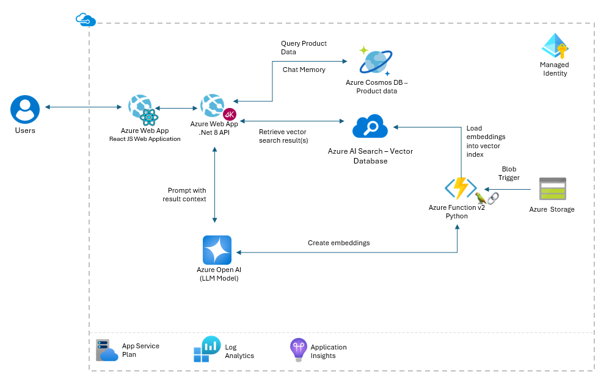
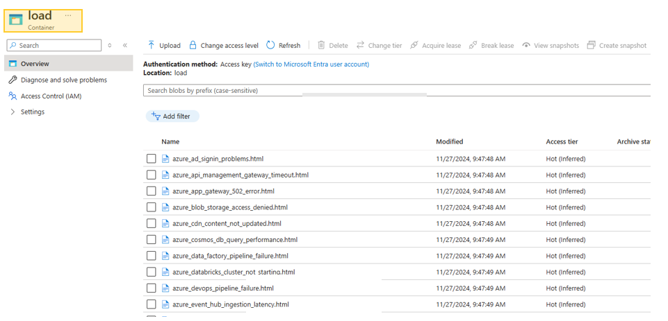
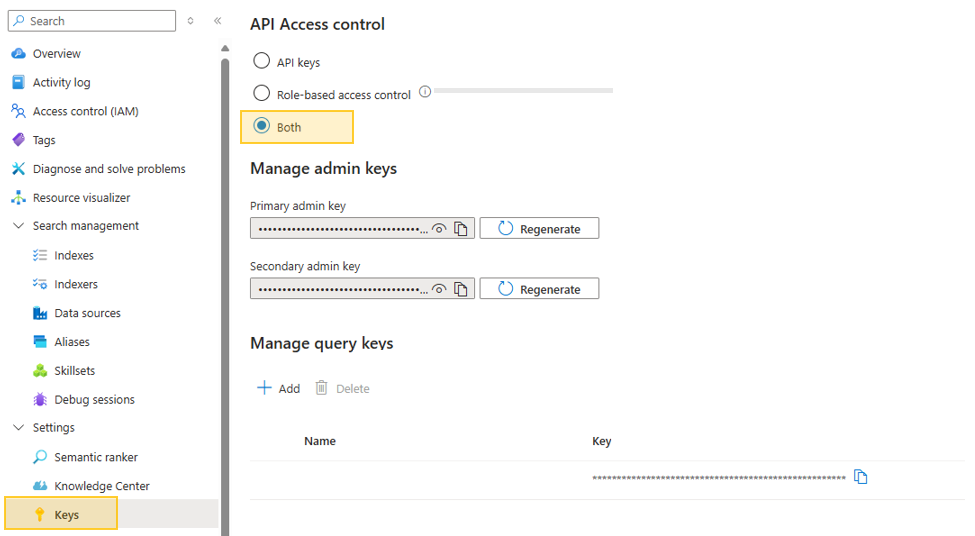
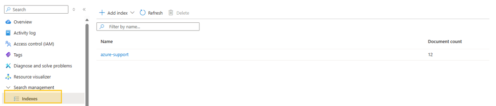
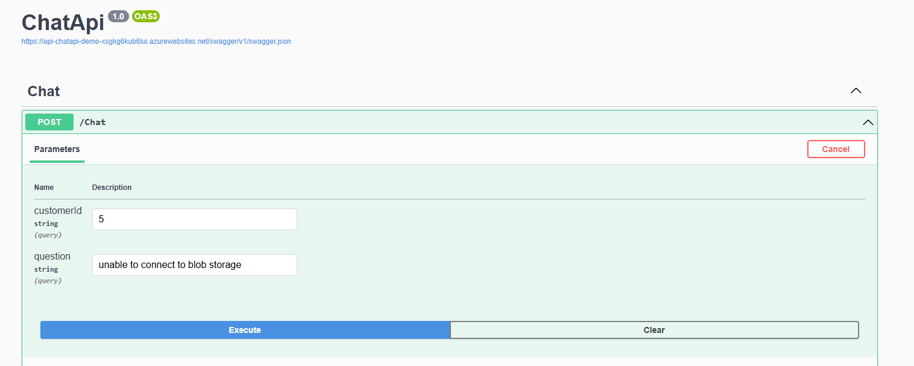

> [!WARNING]  
> **This project is currently in active development and may contain breaking changes.**  
> Updates and modifications are being made frequently, which may impact stability or functionality. This notice will be removed once development is complete and the project reaches a stable release.


# GenAI RAG Chat Solution with .NET, Semantic Kernel Function, Python, and React JS  

## Overview  

This repository provides a comprehensive guide to deploying a Generative AI (GenAI) solution on Azure utilizing a Retrieval-Augmented Generation (RAG) architecture. The solution features a RAG Chat API with a web front-end that seamlessly integrates CosmosDB data and technical HTML files, enabling customer support teams to resolve issues more efficiently.

Built on a .NET-based API backend, the solution leverages Azure AI Search for vector storage and Azure OpenAI for model inference. It is further enhanced with Semantic Kernel functions, Python scripts, and a React JS front-end, ensuring a robust and scalable framework for delivering accurate and context-aware customer support.

## Key Features  

- **RAG Architecture**: Implements a Retrieval-Augmented Generation workflow, combining generative AI with vectorized retrieval for contextually enriched responses.  
- **Azure AI Search Vector Store**: Leverages Azure AI Search for efficient embedding storage, enabling fast retrieval of relevant data to enhance responses.  
- **Azure Cosmos DB Document Store**: Utilizes Azure Cosmos DB to store documents and provide additional context for the GenAI chat application.  
- **Azure OpenAI Integration**: Incorporates OpenAI models for generating high-quality responses and insights.  
- **LangChain Integration**: Utilizes LangChain with Azure OpenAI to streamline and optimize AI-driven interactions.  
- **Prompty Integration**: Enhances prompt engineering for dynamic and adaptive AI behavior, improving user query handling.  
- **Semantic Kernel Integration**: Employs Semantic Kernel to orchestrate workflows, ensuring efficient, context-aware AI responses.  
- **.NET Backend**: Handles API orchestration and server-side processing, seamlessly integrating Azure services.  
- **Event-Driven Document Processing**: Uses Azure Functions to create vector embeddings in Azure Cosmos DB for MongoDB VCore, triggered by document uploads.  
- **Infrastructure as Code (IaC)**: Deploys resources using Bicep and Azure CLI to ensure consistent, scalable, and secure infrastructure management.  


## Architecture  

  

### Components Overview  

- **Backend**:  
  - Built with .NET, using a controller-based API for efficient AI logic handling and data processing.  
  - Azure Functions manage event-driven tasks for scalable, responsive execution.  

- **Database**:  
  - Azure Cosmos DB serves as the primary database, supporting document storage and context enrichment.  
  - Azure AI Search provides vector search capabilities, ensuring fast and relevant data retrieval.  

- **AI Models**:  
  - Powered by Azure OpenAI Service, featuring advanced generative text and embedding models.  
  - Enhances user interactions with high-quality, context-aware responses based on input queries.  


## Requirements
- Azure subscription for deploying Azure GenAI RAG Application.
- [Azure CLI](https://learn.microsoft.com/en-us/cli/azure/get-started-with-azure-cli) (Command Line Interface)
- .NET 8.0 is installed and properly configured in the development environment.
- Python 3.11.4 installed on development environment.
- An IDE for Development, such as [VS Code](https://code.visualstudio.com/download)


## Usage

Follow these steps to set up and deploy the solution:

### 1. Clone the Repository from GitHub:  
Begin by cloning the repository to your local machine using the following command:

```bash
git clone https://github.com/jonathanscholtes/Azure-AI-RAG-CSharp-Prompty.git
cd Azure-AI-RAG-CSharp-Prompty
```

### 2. Deploy the Solution Using Bicep:  
Navigate to the deployment directory:

```bash
cd infra
```

Then, use the following PowerShell command to deploy the solution. Make sure to replace the placeholders with your actual subscription name, Azure Region (location)

**PowerShell**
```bash
.\deploy.ps1 -Subscription '[Subscription Name]' -Location 'southcentralus'
```

This script will provision the necessary resources in your Azure subscription according to the specified parameters. The deployment may take upto **20 minutes** to provision all Azure resources.


### 3. Upload Documents for Azure AI Search Indexing:

Upload the HTML files from the [documents](documents) directory to the **load** container of the Azure Storage Account.



### 4. Validate Embedding Load in Azure AI Search
The Loader Azure Function will trigger and upload the index as the documents are added to the Azure Storage Account. We can view the index and number of documents in the index from our Azure AI Search Service.

##### Grant Access to Query Index From Portal
If you received an error attempting to query the index from the portal you will need to set the API Access control to **both**.



##### Validate Index Creation
You can quickly verify that you have the index **azure-support** with the indexed documents by viewing *indexes*. 




### 6. Validate GenAI Application

Access the Azure Web App hosting the API (/swagger) by navigating to its assigned domain. Once the application loads, test its functionality by submitting the default question, "unable to connect to blob storage" for customer 5.



Upon submission, you should see the following results displayed:

```json
{"answer":"Hi there!\n\nI\u0027m sorry to hear you\u0027re having trouble accessing your Azure Blob Storage. Let\u0027s see if we can fix that. \uD83D\uDE0A\n\nHere are a few steps you can take to troubleshoot the \u0022Access Denied\u0022 issue:\n\n1. **Check Permissions**: Ensure that the user or application trying to access the Blob Storage has the necessary permissions (read, write, or delete).\n\n2. **SAS Token**: Make sure the Shared Access Signature (SAS) token you\u0027re using is valid and hasn\u0027t expired. If it has, generate a new one.\n\n3. **Authentication Credentials**: Double-check that the account name and account key are correctly entered. Ensure there are no typos.\n\n4. **Azure Active Directory (AAD)**: If you\u0027re using AAD, confirm that the user or application has the appropriate roles and permissions assigned.\n\n5. **Firewall and Virtual Network Settings**: Verify that the required IP addresses or ranges are allowed to access the Blob Storage.\n\nIf you follow these steps and the issue persists, it might be a good idea to reach out to Azure support for more specific guidance.\n\nReference Code: AZBLOB5\n\nFeel free to ask if you have any more questions.\n\nBest,\n[Your Name]","context":[{"reference_code":"AZBLOB5","title":"Azure Blob Storage Access Denied","content":"Title: Azure Blob Storage Access Denied\nMain Heading: Azure Blob Storage Access Denied\n\nDescription:\nAccessing Azure Blob Storage may fail due to incorrect permissions, invalid SAS tokens, or missing authentication credentials. This can result in an \u0022Access Denied\u0022 error message. Resolving this issue involves ensuring that the user or application has appropriate access rights to the Blob Storage account. It is important to check the permissions, SAS tokens, and authentication credentials to ensure they are correctly configured.\nIf the above resolution steps do not resolve the issue, consider reaching out to Azure support for further assistance. They can provide more specific guidance based on your specific scenario and help troubleshoot any underlying issues.\nAZBLOB5\n\nPossible Error Messages:\n\u0022Access Denied\u0022\n\u0022Permission Denied\u0022\n\u0022Invalid SAS Token\u0022\n\u0022Authentication Failed\u0022\nVerify the permissions assigned to the user or application accessing the Blob Storage. Ensure that the necessary permissions are granted, such as read, write, or delete access.\nCheck the SAS token used for authentication. Make sure it is valid and has not expired. Generate a new SAS token if needed.\nEnsure that the authentication credentials, such as the account name and account key, are correctly entered. Double-check for any typos or mistakes.\nIf using Azure Active Directory (AAD) authentication, verify that the user or application has the necessary permissions and roles assigned in AAD.\nIf the issue persists, check the firewall and virtual network settings for the Blob Storage account. Ensure that the necessary IP addresses or ranges are allowed to access the storage.\n\nResolution Steps:\nVerify the permissions assigned to the user or application accessing the Blob Storage. Ensure that the necessary permissions are granted, such as read, write, or delete access.\nCheck the SAS token used for authentication. Make sure it is valid and has not expired. Generate a new SAS token if needed.\nEnsure that the authentication credentials, such as the account name and account key, are correctly entered. Double-check for any typos or mistakes.\nIf using Azure Active Directory (AAD) authentication, verify that the user or application has the necessary permissions and roles assigned in AAD.\nIf the issue persists, check the firewall and virtual network settings for the Blob Storage account. Ensure that the necessary IP addresses or ranges are allowed to access the storage.\n\nNext Steps:\nIf the above resolution steps do not resolve the issue, consider reaching out to Azure support for further assistance. They can provide more specific guidance based on your specific scenario and help troubleshoot any underlying issues.\nAZBLOB5\n\nReference Code: AZBLOB5\n"}]}
```

## Clean-Up

After completing testing, ensure to delete any unused Azure resources or remove the entire Resource Group to avoid incurring additional charges.

### Resource Purge for Redeployment

If you plan to delete and redeploy this solution, you may need to manually purge **Azure OpenAI**.

#### Azure OpenAI Purge

To permanently delete an Azure OpenAI or other Azure AI service, follow [these steps](https://learn.microsoft.com/en-us/azure/ai-services/recover-purge-resources?tabs=azure-portal#purge-a-deleted-resource):

1. **Navigate to the Azure AI Service Hub**:  
   Go to the hub of the Azure AI service associated with the deleted resource. For instance, if you need to purge an "Anomaly Detector" resource, search for "Anomaly Detector" in the Azure portal search bar, select the service, and then choose **Manage Deleted Resources** from the menu.

2. **Select the Subscription and Deleted Resource**:  
   In the **Manage Deleted Resources** section, choose the relevant subscription from the dropdown list, then locate and select the deleted resource(s) you wish to purge.

3. **Purge the Resource**:  
   Click **Purge** to permanently delete the selected resource(s). Be aware that purging is irreversible and removes all associated configurations and data for the resource.


## License
This project is licensed under the [MIT License](MIT.md), granting permission for commercial and non-commercial use with proper attribution.

## Support
For any questions or issues, please [open an issue](https://github.com/jonathanscholtes/Azure-AI-RAG-CSharp-Prompty/issues) on GitHub or reach out to the project maintainers.

## Disclaimer
This demo application is intended solely for educational and demonstration purposes. It is provided "as-is" without any warranties, and users assume all responsibility for its use.
